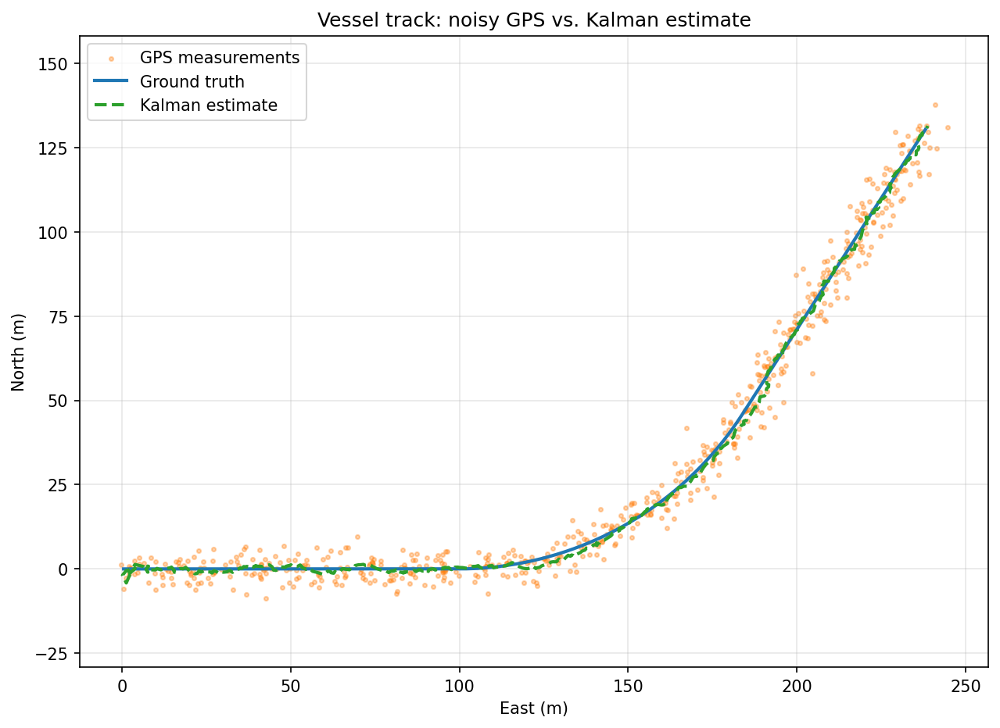

# maritime-tracker

2D vessel tracking with a Kalman filter, written in C++20. Simulates a boat, corrupts its position with GPS noise, and recovers the true track — including velocity and heading, which the sensor never measures.



Blue is ground truth, orange is the raw GPS, green is the filter estimate.

## Results

60s run at 10Hz (600 steps), GPS noise σ = 3m per axis, zero-mean Gaussian.

```
RMSE raw GPS:   4.53 m
RMSE filtered:  1.28 m
Improvement:    3.5x
```

Speed recovered: 5.42 m/s (true 5.00). Heading recovered: 58.8° (true 57.3°). Neither is measured by the sensor.
 
RMSE skips the first 2s while the initial covariance (P₀ = 500·I) collapses — that's the squiggle near the origin. Including it would understate steady-state performance.

Two sanity checks on those numbers:
- Expected 2D radial error for σ = 3m per axis is 3√2 ≈ 4.24m. Measured 4.53m, so the noise model checks out.
- Filtered error (1.28m) is smaller than the sensor's own per-axis σ, which is only possible by combining measurements over time.
## Build
 
```bash
cmake -B build -DCMAKE_BUILD_TYPE=Debug
cmake --build build -j
./build/tracker          # writes output/run.csv
python tools/plot.py     # writes output/track.png, prints RMSE
./build/tests            # Catch2 suite
```
 
Eigen is fetched by CMake. Plotting needs matplotlib.
 
## Design
 
```
BoatSimulator  ->  GpsSensor  ->  KalmanFilter  ->  CSV  ->  plot.py
   (truth)         (corrupt)       (estimate)
```
 
The simulator owns ground truth and runs the boat through a straight-turn-straight track. The sensor takes truth and returns position only, plus noise. The filter sees nothing else.
 
The filter never touches ground truth, and that's enforced by the types — `GpsMeasurement` has no heading or speed field, so it can't be read even by accident. A filter that peeks at truth looks perfect and proves nothing.
 
State is `[px, py, vx, vy]`. Each step: predict (advance by the motion model, grow uncertainty), then update (correct toward the measurement, shrink uncertainty). The Kalman gain isn't hand-tuned — it falls out of the ratio between the filter's uncertainty and the sensor's.
 
GPS reports position only, never velocity, but the filter estimates velocity anyway. The covariance matrix's off-diagonal terms encode the correlation between position error and velocity error, built up by the motion model during predict. The gain is 4x2 — it takes a 2-element position correction and spreads it across all four state elements.
 
Other choices:
- **C++ over Python.** The math is easier in NumPy, but I wanted to build it in the language this actually runs in.
- **Seeded RNG.** `std::mt19937` with a fixed seed. Change a parameter, rerun, and any difference came from the change and not from different noise. Debugging an estimator against non-reproducible input is miserable.
- **Simulator and filter use different motion models on purpose.** Simulator moves by heading + speed with a turn rate; filter assumes constant velocity. The world doesn't move the way the estimator assumes. Lower Q and you can watch the estimate cut the corner through the turn.
- **Euler integration at dt = 0.1s.** Straight-line steps chord the true arc. RK4 would be the upgrade.
## Tests
 
```
./build/tests    # 3 cases, 9 assertions
```
 
1. **Convergence** — noiseless sensor, estimate converges to truth within 0.1m and vx converges to 5.0.
2. **Covariance** — `P.trace()` grows after predict, shrinks after update. Catches sign errors in the update step.
3. **GPS denial** — calling predict without update is dead reckoning. Filter coasts for 5s, error stays bounded under 10m, then recovers when measurements return. Only works because it estimated velocity in the first place.
## Limitations
 
- Linear KF only, no EKF/UKF or nonlinear measurement models
- Single synchronous sensor, perfect timestamps, no async fusion or time alignment
- Noise is Gaussian by construction, which is exactly what the filter assumes. Real GPS multipath isn't.
- No outlier rejection (no chi-squared gating on the innovation)
- Flat-earth local frame, no geodetic conversion
- Nothing steers the boat — it follows a scripted trajectory
## Open questions
 
- When does CV-with-inflated-Q stop being enough and you need CTRV or an IMM? Rule of thumb or empirical?
- How do you tune Q against real data instead of guessing? Is innovation whiteness the standard diagnostic?
- With async sensors at different rates, do you predict forward to each timestamp or buffer and batch?
- Where's the line between filtering something and learning it?
 